# Indeksy, optymalizator <br>Lab1

<!-- <style scoped>
 p,li {
    font-size: 12pt;
  }
</style>  -->

<!-- <style scoped>
 pre {
    font-size: 8pt;
  }
</style>  -->

---

**Imiona i nazwiska: Wiktoria Zalińska, Magdalena Wilk**

---

Celem ćwiczenia jest zapoznanie się z planami wykonania zapytań (execution plans), oraz z budową i możliwością wykorzystaniem indeksów.

Swoje odpowiedzi wpisuj w miejsca oznaczone jako:

---

> Wyniki:

```sql
--  ...
```

---

Ważne/wymagane są komentarze.

Zamieść kod rozwiązania oraz zrzuty ekranu pokazujące wyniki

- dołącz kod rozwiązania w formie tekstowej/źródłowej
- można dołączyć plik .md albo .sql

Zwróć uwagę na formatowanie kodu

## Oprogramowanie - co jest potrzebne?

Do wykonania ćwiczenia potrzebne jest następujące oprogramowanie

- MS SQL Server
- SSMS - SQL Server Management Studio
  - ewentualnie inne narzędzie umożliwiające komunikację z MS SQL Server i analizę planów zapytań
- przykładowa baza danych AdventureWorks2017.

Oprogramowanie dostępne jest na przygotowanej maszynie wirtualnej

## Przygotowanie

Stwórz swoją bazę danych o nazwie lab4.

```sql
create database lab1
go

use lab1
go
```

# Część 1

Celem tej części ćwiczenia jest zapoznanie się z planami wykonania zapytań (execution plans) oraz narzędziem do automatycznego generowania indeksów.

## Dokumentacja/Literatura

Przydatne materiały/dokumentacja. Proszę zapoznać się z dokumentacją:

- [https://docs.microsoft.com/en-us/sql/tools/dta/tutorial-database-engine-tuning-advisor](https://docs.microsoft.com/en-us/sql/tools/dta/tutorial-database-engine-tuning-advisor)
- [https://docs.microsoft.com/en-us/sql/relational-databases/performance/start-and-use-the-database-engine-tuning-advisor](https://docs.microsoft.com/en-us/sql/relational-databases/performance/start-and-use-the-database-engine-tuning-advisor)
- [https://www.simple-talk.com/sql/performance/index-selection-and-the-query-optimizer](https://www.simple-talk.com/sql/performance/index-selection-and-the-query-optimizer)
- [https://blog.quest.com/sql-server-execution-plan-what-is-it-and-how-does-it-help-with-performance-problems/](https://blog.quest.com/sql-server-execution-plan-what-is-it-and-how-does-it-help-with-performance-problems/)

Operatory (oraz reprezentujące je piktogramy/Ikonki) używane w graficznej prezentacji planu zapytania opisane są tutaj:

- [https://docs.microsoft.com/en-us/sql/relational-databases/showplan-logical-and-physical-operators-reference](https://docs.microsoft.com/en-us/sql/relational-databases/showplan-logical-and-physical-operators-reference)

<div style="page-break-after: always;"></div>

Wykonaj poniższy skrypt, aby przygotować dane:

```sql
select * into [salesorderheader]
from [adventureworks2017].sales.[salesorderheader]
go

select * into [salesorderdetail]
from [adventureworks2017].sales.[salesorderdetail]
go
```

# Zadanie 1 - Obserwacja

Wpisz do MSSQL Managment Studio (na razie nie wykonuj tych zapytań):

```sql
-- zapytanie 1
select *
from salesorderheader sh
inner join salesorderdetail sd on sh.salesorderid = sd.salesorderid
where orderdate = '2008-06-01 00:00:00.000'
go

-- zapytanie 1.1
select *
from salesorderheader sh
inner join salesorderdetail sd on sh.salesorderid = sd.salesorderid
where orderdate = '2013-01-28 00:00:00.000'
go

-- zapytanie 2
select orderdate, productid, sum(orderqty) as orderqty,
       sum(unitpricediscount) as unitpricediscount, sum(linetotal)
from salesorderheader sh
inner join salesorderdetail sd on sh.salesorderid = sd.salesorderid
group by orderdate, productid
having sum(orderqty) >= 100
go

-- zapytanie 3
select salesordernumber, purchaseordernumber, duedate, shipdate
from salesorderheader sh
inner join salesorderdetail sd on sh.salesorderid = sd.salesorderid
where orderdate in ('2008-06-01','2008-06-02', '2008-06-03', '2008-06-04', '2008-06-05')
go

-- zapytanie 4
select sh.salesorderid, salesordernumber, purchaseordernumber, duedate, shipdate
from salesorderheader sh
inner join salesorderdetail sd on sh.salesorderid = sd.salesorderid
where carriertrackingnumber in ('ef67-4713-bd', '6c08-4c4c-b8')
order by sh.salesorderid
go
```

Włącz dwie opcje: **Include Actual Execution Plan** oraz **Include Live Query Statistics**:

<!-- ![[_img/index1-1.png | 500]] -->


Teraz wykonaj poszczególne zapytania (najlepiej każde analizuj oddzielnie). Co można o nich powiedzieć? Co sprawdzają? Jak można je zoptymalizować?

---

> Wyniki:

- Zapytanie 1:

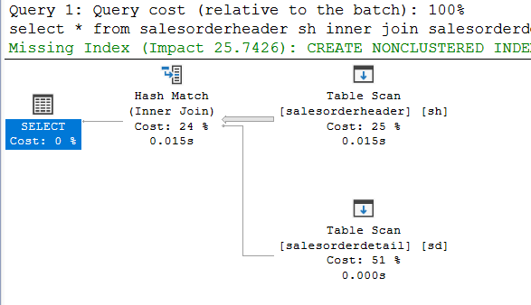

- Zapytanie 1.1:

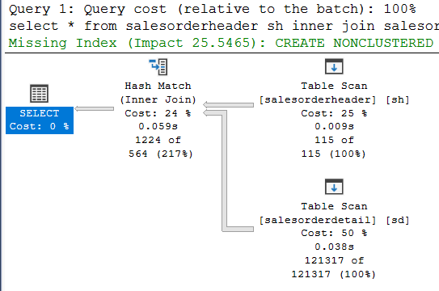

Zapytanie 1 i 1.1 szukają danych dla konkretnych dat - mamy tutaj porównanie wyszukiwania danych dla danych znajdujących się w różnych miejscach w tabeli.

- Zapytanie 2:

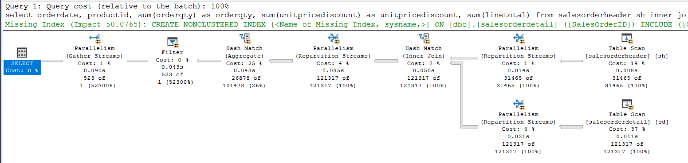

Zapytanie 2 grupuje zamówienia według daty i produktu oraz filtruje grupy, dla których zamówiono przynajmniej 100 produktów.

- Zapytanie 3:

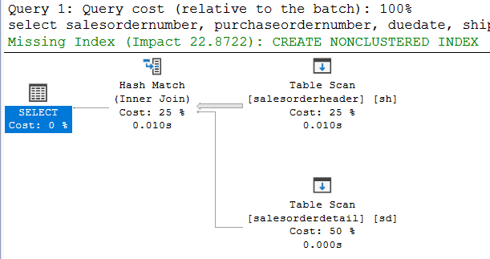

Zapytanie 3 pobiera zamówienie dla 5 konkretnych dni, a więc sprawdza wyszukiwanie danych dla kilku dat na raz.

- Zapytanie 4:


Zapytanie 4 filtruje dane po numerze śledzenia przesyłki i sortuje po numerze zamówienia.

W celach optymalizacji mozna wybierać tylko konkretne kolumny, które są nam potrzebne, a także zastosować indeksy:

dla kolumn w joinie: salesorderid dla obu tablic,

dla 1, 2, 3 zapytania dla orderdate znajdujące się w WHERE/GROUP BY,

dla 2 zapytania jeszcze dodatkowo dla productid znajdującego się w GROUP BY,

dla 4 zapytania dla carriertrackingnumber (w WHERE), salesorderid (ORDER BY):

```sql
CREATE INDEX idx_orderdate_salesorderid ON salesorderheader(orderdate, salesorderid);
CREATE INDEX idx_salesorderid ON salesorderdetail(salesorderid);

CREATE INDEX idx_productid ON salesorderdetail(productid);

CREATE INDEX idx_carriertrackingnumber_salesorderid ON salesorderdetail(carriertrackingnumber, salesorderid);
```

W wyniku utworzenia indeksów, otrzymano krótsze czas zapytań oraz mniejszą liczbę odpowiednich odczytów:

|             |       |                     |                                  |                                  |
| ----------- | ----- | ------------------- | -------------------------------- | -------------------------------- |
| zapytanie   | koszt | czas [elapsed] [ms] | logical reads w salesorderdetail | logical reads w salesorderheader |
| 1           | 2.461 | 7                   | -                                | 791                              |
| 1 (index)   | 0.019 | 2                   | -                                | 2                                |
| 1.1         | 2.480 | 63                  | 1504                             | 791                              |
| 1.1 (index) | 1.937 | 43                  | 1488                             | 117                              |
| 2           | 3.057 | 95                  | 1504                             | 791                              |
| 2 (index)   | 1.829 | 86                  | 1504                             | 307                              |
| 3           | 2.501 | 8                   | -                                | 791                              |
| 3 (index)   | 0.009 | 1                   | -                                | 10                               |
| 4           | 2.153 | 26                  | 1504                             | 791                              |
| 4 (index)   | 0.800 | 13                  | 6                                | 791                              |

Plany zapytań po dodaniu indeksów:

- 1 z index:

  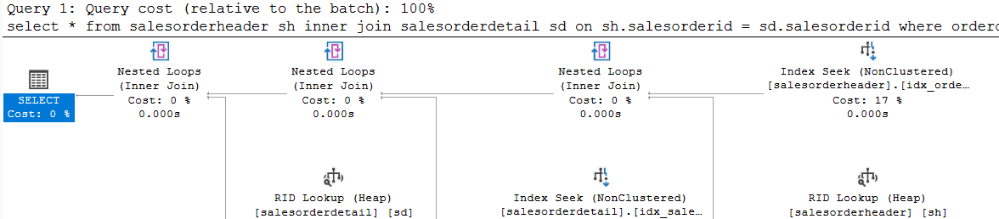

- 1.1 z index:

  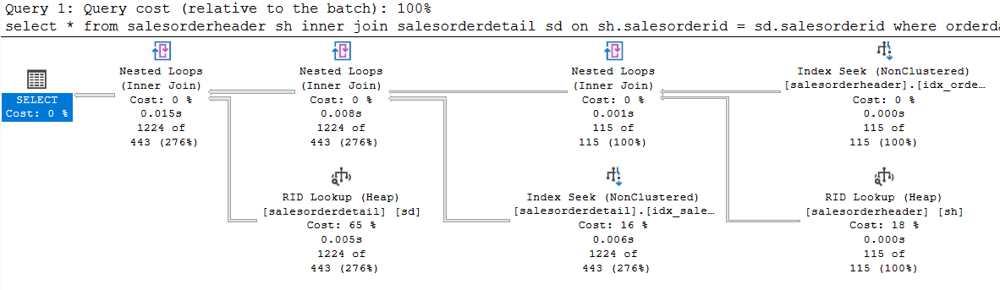

- 2 z index:

  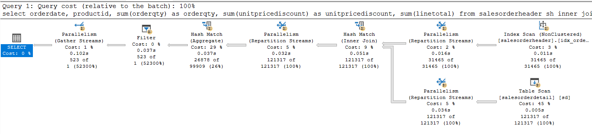

- 3 z index:

  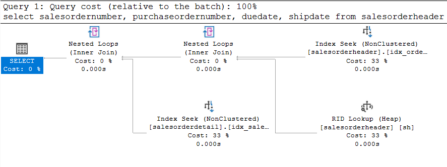

- 4 z index:

  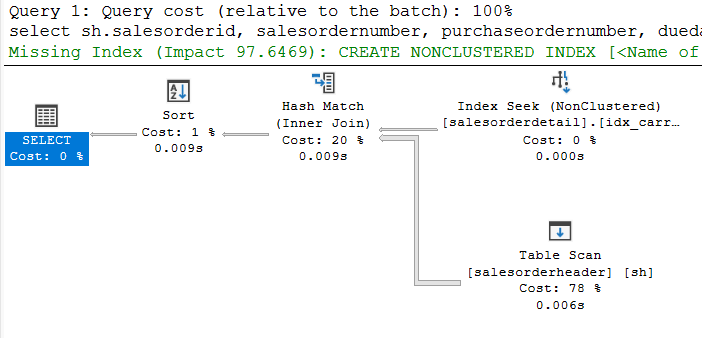

---

# Zadanie 2 - Dobór indeksów / optymalizacja

Do wykonania tego ćwiczenia potrzebne jest narzędzie SSMS

Zaznacz wszystkie zapytania, i uruchom je w **Database Engine Tuning Advisor**:

<!-- ![[_img/index1-12.png | 500]] -->


Sprawdź zakładkę **Tuning Options**, co tam można skonfigurować?

---

> Wyniki:

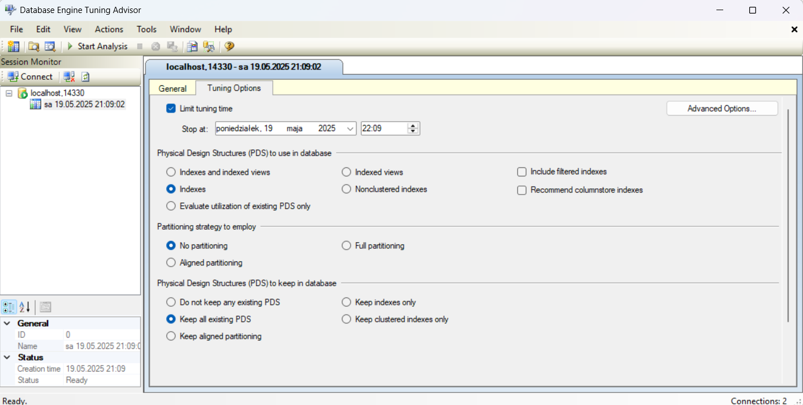

Database Engine Tuning Advisor służy do analizy wydajności zapytań i proponowania optymalizacji indeksów i partycjonowania.

- **Limit tuning time** - określa, jak długo ma trwać analiza.
- **Physical Design Structures** - możemy tam określić, jakie rodzaje indeksów może nam zaproponować Tuning Advisor, m.in. pełna analiza, tylko indeksy, tylko nieklastrowe indeksy, tylko widoki indeksowane, itd..
- **Evaluate utilization of existing PDS only** - jeśli zaznaczymy, Tuning Advisor nie zaproponuje nowych indeksów, oceni tylko czy już istniejące indeksy są używane efektywnie.
- **Partitioning strategy to employ** - określa, czy brać pod uwagę możliwość zastosowania partycjonowania tabel.
- **Physical Design Structures (PDS) to keep in database** - określa, czy istniejące struktury mogą być usuwane. Najbezpieczniej jest wybrać opcję _Keep all existing PDS_ - nic nie zostaje usunięte, może dodać tylko nowe struktury.

---

Użyj **Start Analysis**:

<!-- ![[_img/index1-3.png | 500]] -->


Zaobserwuj wyniki w **Recommendations**.

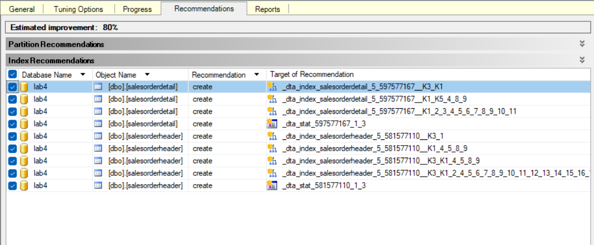

Przejdź do zakładki **Reports**. Sprawdź poszczególne raporty. Główną uwagę zwróć na koszty i ich poprawę:

<!-- ![[_img/index4-1.png | 500]] -->

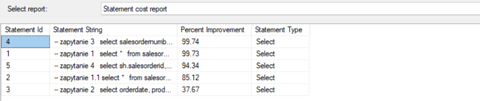

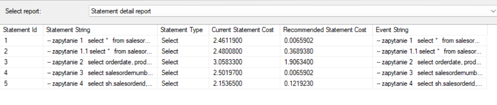

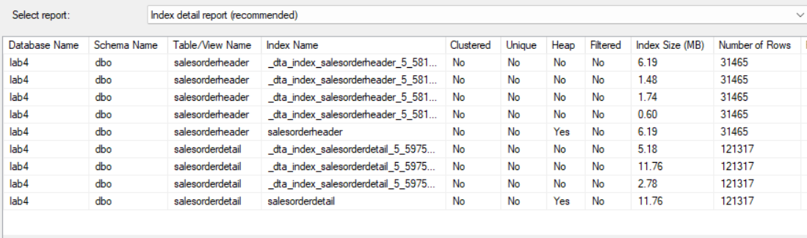

Utworzenie indeksów znacząco zredukowało koszty zapytań - w przypadku niektórych nawet o blisko 100%.

Zapisz poszczególne rekomendacje:

Uruchom zapisany skrypt w Management Studio.

Opisz, dlaczego dane indeksy zostały zaproponowane do zapytań:

---

> Wyniki: Otrzymany skrypt

```sql
use [lab4]
go

-- indeks 1
CREATE NONCLUSTERED INDEX
  [_dta_index_salesorderdetail_5_597577167__K1_2_3_4_5_6_7_8_9_10_11]
  ON [dbo].[salesorderdetail]
(
	[SalesOrderID] ASC
)
INCLUDE([SalesOrderDetailID],[CarrierTrackingNumber],[OrderQty],
  [ProductID],[SpecialOfferID],[UnitPrice],[UnitPriceDiscount],
  [LineTotal],[rowguid],[ModifiedDate])
  WITH (SORT_IN_TEMPDB = OFF, DROP_EXISTING = OFF, ONLINE = OFF)
  ON [PRIMARY]
go

-- indeks 2
CREATE NONCLUSTERED INDEX
  [_dta_index_salesorderdetail_5_597577167__K1_K5_4_8_9]
  ON [dbo].[salesorderdetail]
(
	[SalesOrderID] ASC,
	[ProductID] ASC
)
INCLUDE([OrderQty],[UnitPriceDiscount],[LineTotal])
  WITH (SORT_IN_TEMPDB = OFF, DROP_EXISTING = OFF, ONLINE = OFF)
  ON [PRIMARY]
go

SET ANSI_PADDING ON

go

-- indeks 3
CREATE NONCLUSTERED INDEX
  [_dta_index_salesorderdetail_5_597577167__K3_K1]
  ON [dbo].[salesorderdetail]
(
	[CarrierTrackingNumber] ASC,
	[SalesOrderID] ASC
)WITH (SORT_IN_TEMPDB = OFF, DROP_EXISTING = OFF,
  ONLINE = OFF) ON [PRIMARY]
go

CREATE STATISTICS [_dta_stat_597577167_1_3]
  ON [dbo].[salesorderdetail]([SalesOrderID], [CarrierTrackingNumber])
go

-- indeks 4
CREATE NONCLUSTERED INDEX [_dta_index_salesorderheader_5_581577110__K3_K1_2_4_5_6_7_8_9_10_11_12_13_14_15_16_17_18_19_20_21_22_23_24_25_26]
  ON [dbo].[salesorderheader]
(
	[OrderDate] ASC,
	[SalesOrderID] ASC
)
INCLUDE([RevisionNumber],[DueDate],[ShipDate],[Status],
  [OnlineOrderFlag],[SalesOrderNumber],[PurchaseOrderNumber],
  [AccountNumber],[CustomerID],[SalesPersonID],[TerritoryID],
  [BillToAddressID],[ShipToAddressID],[ShipMethodID],
  [CreditCardID],[CreditCardApprovalCode],[CurrencyRateID],
  [SubTotal],[TaxAmt],[Freight],[TotalDue],[Comment],
  [rowguid],[ModifiedDate])
  WITH (SORT_IN_TEMPDB = OFF, DROP_EXISTING = OFF, ONLINE = OFF)
  ON [PRIMARY]
go

-- indeks 5
CREATE NONCLUSTERED INDEX
  [_dta_index_salesorderheader_5_581577110__K3_K1_4_5_8_9]
  ON [dbo].[salesorderheader]
(
	[OrderDate] ASC,
	[SalesOrderID] ASC
)
INCLUDE([DueDate],[ShipDate],[SalesOrderNumber],[PurchaseOrderNumber])
  WITH (SORT_IN_TEMPDB = OFF, DROP_EXISTING = OFF, ONLINE = OFF)
  ON [PRIMARY]
go

-- indeks 6
CREATE NONCLUSTERED INDEX
  [_dta_index_salesorderheader_5_581577110__K1_4_5_8_9]
  ON [dbo].[salesorderheader]
(
	[SalesOrderID] ASC
)
INCLUDE([DueDate],[ShipDate],[SalesOrderNumber],
  [PurchaseOrderNumber]) WITH
  (SORT_IN_TEMPDB = OFF, DROP_EXISTING = OFF, ONLINE = OFF)
  ON [PRIMARY]
go

--indeks 7
CREATE NONCLUSTERED INDEX
  [_dta_index_salesorderheader_5_581577110__K3_1]
  ON [dbo].[salesorderheader]
(
	[OrderDate] ASC
)
INCLUDE([SalesOrderID]) WITH
  (SORT_IN_TEMPDB = OFF, DROP_EXISTING = OFF, ONLINE = OFF)
  ON [PRIMARY]
go

CREATE STATISTICS [_dta_stat_581577110_1_3]
  ON [dbo].[salesorderheader]([SalesOrderID], [OrderDate])
go
```

Indeks 1 - kolumną kluczową jest _SalesOrderID_, dołączone są prawie wszystkie pozostałe kolumny, ponieważ zapytania często łączą tabele _salesorderheader_ i _salesorderdetail_ po _SalesOrderID_, a reszta kolumn jest często wybierana w poleceniu `select`.

Indeks 2 - jest stworzony do optymalizacji zapytania 2. Kolumny kluczowe to _SalesOrderID_ oraz _ProductID_, ponieważ są wybrane w `select` i po nich są grupowane rekordy, a dodatkowe kolumny _OrderQty_, _UnitPriceDiscount_, _LineTotal_ są agregowane w `select`. Indeks pomaga grupować i filtrować dane.

Indeks 3 - umozliwia szybsze sortowanie i filtrowanie w zapytaniu 4, w którym dane są sortowane po _SalesOrderID_ oraz filtrowane przez warunek na _CarrierTrackingNumber_. Dodatkowo stworzone statystyki maja wspierać optymalizator w planowaniu wykonywania zapytań.

Indeks 4 - wspiera sortowanie i filtrowanie po _OrderDate_, drugą kluczową kolumną jest _SalesOrderID_, a dołączone są prawie wszystkie kolumny. Jest używany w zapytaniach, gdzie wybieramy wiele kolumn, np. zapytanie 1.

Indeks 5 - stworzony do zapytania 3, które używa wyszczególnionych kolumn.

Indeks 6 - od poprzedniego indeksu różni się tylko o _OrderDate_, ma wspierać zapytanie 4, ktore nie używa _OrderDate_.

Indeks 7 - kolumną kluczową jest _OrderDate_, dodatkową _SalesOrderID_. Jest to prosty indeks do filtrowania po dacie. Podobnie jak przy indeksie 3 stworzone zostały również statystyki.

Sprawdź jak zmieniły się Execution Plany. Opisz zmiany:

Koszty wykonywania zapytań zdecydowanie zmalały. Czasy wykonywania również poza zapytaniem 2.

Zapytanie 1
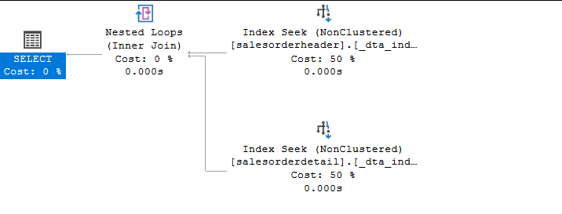

Zapytanie 1.1
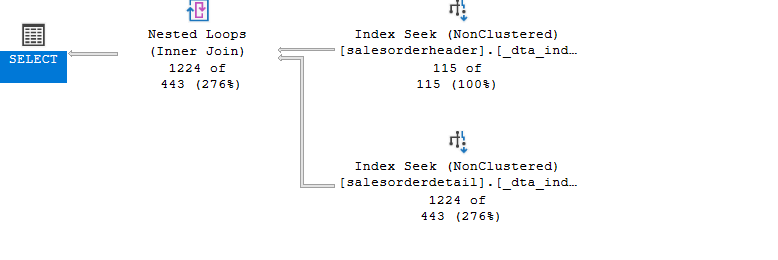

Zapytanie 2
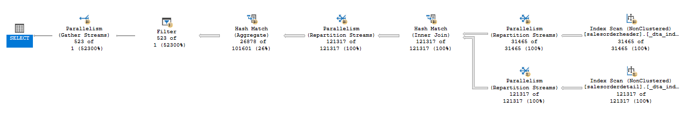

Zapytanie 3
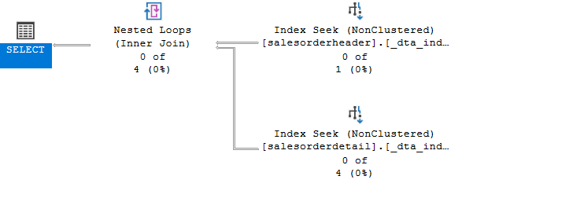

Zapytanie 4
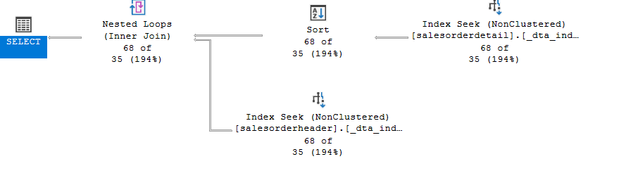

|             |       |                     |
| ----------- | ----- | ------------------- |
| zapytanie   | koszt | czas [elapsed] [ms] |
| 1           | 2.461 | 7                   |
| 1 (index)   | 0.007 | 4                   |
| 1.1         | 2.480 | 63                  |
| 1.1 (index) | 0.369 | 33                  |
| 2           | 3.057 | 95                  |
| 2 (index)   | 1.984 | 139                 |
| 3           | 2.501 | 8                   |
| 3 (index)   | 0.007 | 3                   |
| 4           | 2.153 | 26                  |
| 4 (index)   | 0.119 | 5                   |

---

# Część 2

Celem ćwiczenia jest zapoznanie się z różnymi rodzajami indeksów oraz możliwością ich wykorzystania

## Dokumentacja/Literatura

Przydatne materiały/dokumentacja. Proszę zapoznać się z dokumentacją:

- [https://docs.microsoft.com/en-us/sql/relational-databases/indexes/indexes](https://docs.microsoft.com/en-us/sql/relational-databases/indexes/indexes)
- [https://docs.microsoft.com/en-us/sql/relational-databases/sql-server-index-design-guide](https://docs.microsoft.com/en-us/sql/relational-databases/sql-server-index-design-guide)
- [https://www.simple-talk.com/sql/performance/14-sql-server-indexing-questions-you-were-too-shy-to-ask/](https://www.simple-talk.com/sql/performance/14-sql-server-indexing-questions-you-were-too-shy-to-ask/)
- [https://www.sqlshack.com/sql-server-query-execution-plans-examples-select-statement/](https://www.sqlshack.com/sql-server-query-execution-plans-examples-select-statement/)

# Zadanie 3 - Indeksy klastrowane I nieklastrowane

Skopiuj tabelę `Customer` do swojej bazy danych:

```sql
select * into customer from adventureworks2017.sales.customer
```

Wykonaj analizy zapytań:

```sql
select * from customer where storeid = 594

select * from customer where storeid between 594 and 610
```

Zanotuj czas zapytania oraz jego koszt koszt:

---

> Wyniki:

|           |          |                     |
| --------- | -------- | ------------------- |
| zapytanie | koszt    | czas [elapsed] [ms] |
| 1         | 0.139158 | 3                   |
| 2         | 0.139158 | 4                   |

Plany zapytań:

- pierwsze zapytanie:

  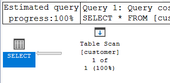

- drugie zapytanie:

  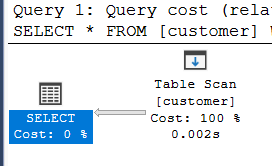

Dodaj indeks:

```sql
create  index customer_store_cls_idx on customer(storeid)
```

Jak zmienił się plan i czas? Czy jest możliwość optymalizacji?

---

> Wyniki:

|           |           |                     |
| --------- | --------- | ------------------- |
| zapytanie | koszt     | czas [elapsed] [ms] |
| 1         | 0.0065704 | 1                   |
| 2         | 0.0507122 | 1                   |

W wyniku dodania indeksu, zmniejszył się czas i koszt dla obu zapytań.

W związku z używaniem SELECT \*, po Index Seek na stworzonym indeksie, następuje RID Lookup dla pobrania pozostałych kolumn.

Aby tego uniknąć można zastosować indeks klastrowany, który patrzy odrazu na cały wiersz, a więc nie trzeba szukać pozostałych danych.

Plany zapytań po dodaniu indeksu:

- pierwsze zapytanie z index:

  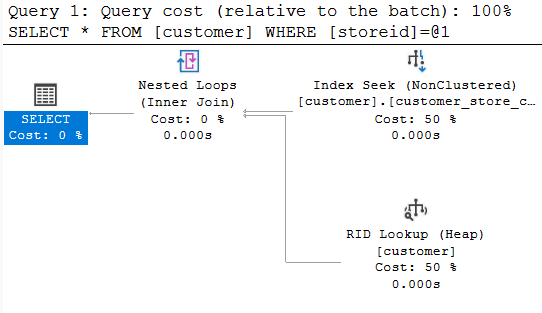

- drugie zapytanie z index:

  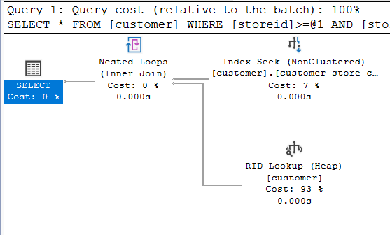

Dodaj indeks klastrowany:

```sql
create clustered index customer_store_cls_idx on customer(storeid)
```

Czy zmienił się plan/koszt/czas? Skomentuj dwa podejścia w wyszukiwaniu krotek.

---

> Wyniki:

|           |           |                     |
| --------- | --------- | ------------------- |
| zapytanie | koszt     | czas [elapsed] [ms] |
| 1         | 0.0032831 | <1                  |
| 2         | 0.0032996 | 1                   |

Plany zapytań po dodaniu indeksu klastrowanego:

- pierwsze zapytanie z index:

  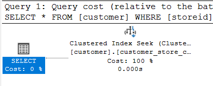

- drugie zapytanie z index:

  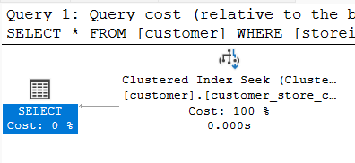

Najkrótszy czas i koszt został uzyskany korzystając z indeksu klastrowanego.

Zwykły indeks sprawdza się dobrze przy samym filtrowaniu, ale wymaga po znalezieniu indeksu, odwołania się do tabeli aby znaleźć resztę danych (jeżeli nie występują w indeksie, tak jak tutaj szukamy \*).

Użycie indeksu klastrowanego powoduje odwołanie się do konkretnego miejsca i odrazu są do dyspozycji wszystkie dane, dlatego jest to bardziej optymalne w przypadku odwoływania się do kolumn, które nie są w indeksie.

# Zadanie 4 - dodatkowe kolumny w indeksie

Celem zadania jest porównanie indeksów zawierających dodatkowe kolumny.

Skopiuj tabelę `Address` do swojej bazy danych:

```sql
select * into address from  adventureworks2017.person.address
```

W tej części będziemy analizować następujące zapytanie:

```sql
select addressline1, addressline2, city, stateprovinceid, postalcode
from address
where postalcode between n'98000' and n'99999'
```

```sql
create index address_postalcode_1
on address (postalcode)
include (addressline1, addressline2, city, stateprovinceid);
go

create index address_postalcode_2
on address (postalcode, addressline1, addressline2, city, stateprovinceid);
go
```

Czy jest widoczna różnica w planach/kosztach zapytań?

- w sytuacji gdy nie ma indeksów
- przy wykorzystaniu indeksu: - address_postalcode_1 - address_postalcode_2
  Jeśli tak to jaka?

Aby wymusić użycie indeksu użyj `WITH(INDEX(Address_PostalCode_1))` po `FROM`

> Wyniki:

```sql
--  ...
```

Sprawdź rozmiar Indeksów:

```sql
select i.name as indexname, sum(s.used_page_count) * 8 as indexsizekb
from sys.dm_db_partition_stats as s
inner join sys.indexes as i on s.object_id = i.object_id and s.index_id = i.index_id
where i.name = 'address_postalcode_1' or i.name = 'address_postalcode_2'
group by i.name
go
```

Który jest większy? Jak można skomentować te dwa podejścia do indeksowania? Które kolumny na to wpływają?

> Wyniki:

```sql
--  ...
```

# Zadanie 5 – Indeksy z filtrami

Celem zadania jest poznanie indeksów z filtrami.

Skopiuj tabelę `BillOfMaterials` do swojej bazy danych:

```sql
select * into billofmaterials
from adventureworks2017.production.billofmaterials
```

W tej części analizujemy zapytanie:

```sql
select productassemblyid, componentid, startdate
from billofmaterials
where enddate is not null
    and componentid = 327
    and startdate >= '2010-08-05'
```

Zastosuj indeks:

```sql
create nonclustered index billofmaterials_cond_idx
    on billofmaterials (componentid, startdate)
    where enddate is not null
```

Sprawdź czy działa.

Przeanalizuj plan dla poniższego zapytania:

Czy indeks został użyty? Dlaczego?

> Wyniki:

```sql
--  ...
```

Spróbuj wymusić indeks. Co się stało, dlaczego takie zachowanie?

> Wyniki:

```sql
--  ...
```

---

Punktacja:

|         |     |
| ------- | --- |
| zadanie | pkt |
| 1       | 3   |
| 2       | 3   |
| 3       | 3   |
| 4       | 3   |
| 5       | 3   |
| razem   | 15  |
|         |     |
