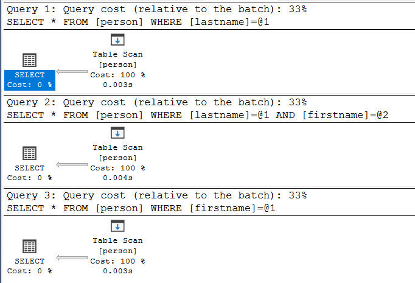
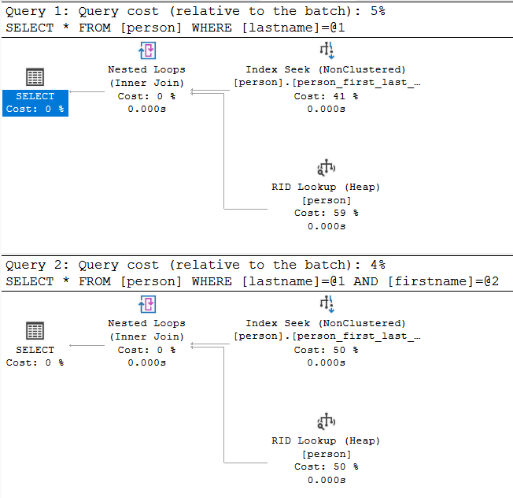
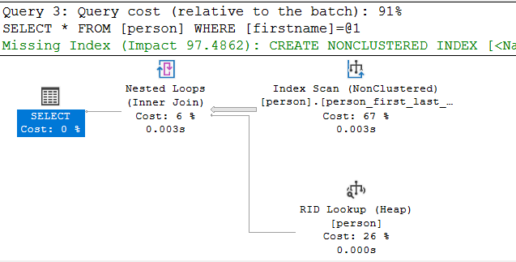
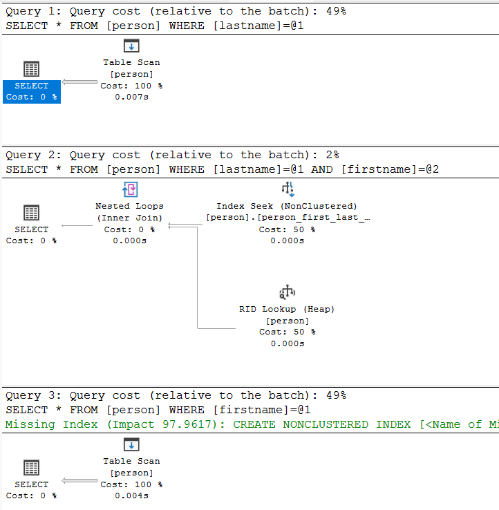
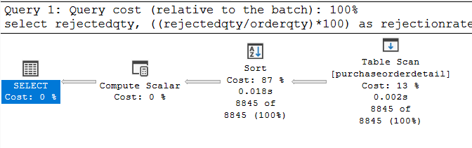
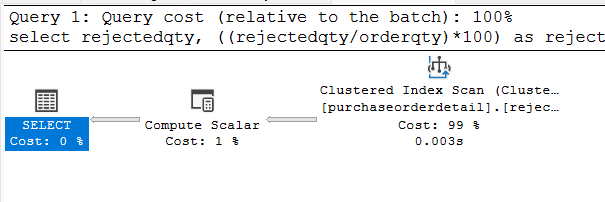
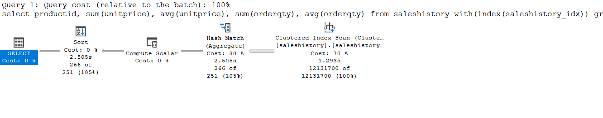
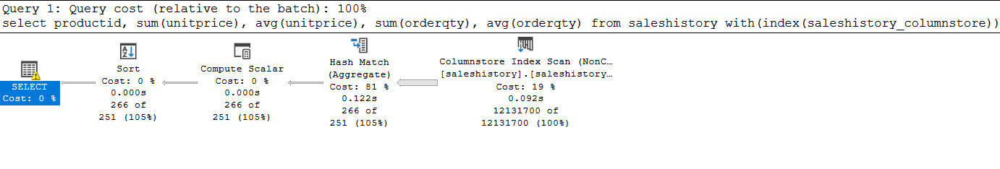

# Indeksy,  optymalizator <br>Lab 2

<!-- <style scoped>
 p,li {
    font-size: 12pt;
  }
</style>  -->

<!-- <style scoped>
 pre {
    font-size: 8pt;
  }
</style>  -->


---

**Imię i nazwisko: Wiktoria Zalińśka, Magdalena Wilk**

--- 

Celem ćwiczenia jest zapoznanie się z planami wykonania zapytań (execution plans), oraz z budową i możliwością wykorzystaniem indeksów 

Swoje odpowiedzi wpisuj w miejsca oznaczone jako:

---
> Wyniki: 

```sql
--  ...
```

---

Ważne/wymagane są komentarze.

Zamieść kod rozwiązania oraz zrzuty ekranu pokazujące wyniki, (dołącz kod rozwiązania w formie tekstowej/źródłowej)

Zwróć uwagę na formatowanie kodu

## Oprogramowanie - co jest potrzebne?

Do wykonania ćwiczenia potrzebne jest następujące oprogramowanie
- MS SQL Server
- SSMS - SQL Server Management Studio    
	- ewentualnie inne narzędzie umożliwiające komunikację z MS SQL Server i analizę planów zapytań
- przykładowa baza danych AdventureWorks2017.
    
Oprogramowanie dostępne jest na przygotowanej maszynie wirtualnej


## Przygotowanie  

Uruchom Microsoft SQL Managment Studio.
    
Stwórz swoją bazę danych o nazwie lab2. 

```sql
create database lab2  
go  
  
use lab2  
go
```


<div style="page-break-after: always;"></div>

# Zadanie 1 


Skopiuj tabelę `Person` do swojej bazy danych:

```sql
select businessentityid  
      ,persontype  
      ,namestyle  
      ,title  
      ,firstname  
      ,middlename  
      ,lastname  
      ,suffix  
      ,emailpromotion  
      ,rowguid  
      ,modifieddate  
into person  
from adventureworks2017.person.person
```
---

Wykonaj analizę planu dla trzech zapytań:

```sql
select * from [person] where lastname = 'Agbonile'  
  
select * from [person] where lastname = 'Agbonile' and firstname = 'Osarumwense'  
  
select * from [person] where firstname = 'Osarumwense'
```

Co można o nich powiedzieć?


---
> Wyniki: 



Każde z zapytań dokonuje skanowania całej tabeli.

---


Przygotuj indeks obejmujący te zapytania:

```sql
create index person_first_last_name_idx  
on person(lastname, firstname);
```

Sprawdź plan zapytania. Co się zmieniło?


---
> Wyniki: 

Plany zapytań po stworzeniu indeksu:





Po stworzeniu indeksu, dla pierwszego i drugiego zapytania tabela jest przeszukiwana po indeksie dla imienia i nazwiska (wykorzystywany jest Index Seek), ale w zapytania wywoływane są wszystkie kolumny, zatem po wyszukaniu imienia, nazwiska po indeksie, przeglądana jest cała tabela - Rid Lookup w celu pobrania pozostałych kolumn. 

W trzecim zapytaniu nie można użyć indeksu ponieważ indeks jest stworzony w kolejności lastname, firstname - a więc próbując wyszukiwać po samym firstname, nie ma dostępu do tego indeksu. 

Ten indeks może zostać efektywnie użyty do zapytań z: lastname i firstname lub samym lastname. 

---


Przeprowadź ponownie analizę zapytań tym razem dla parametrów: `FirstName = ‘Angela’` `LastName = ‘Price’`. (Trzy zapytania, różna kombinacja parametrów). 

Czym różni się ten plan od zapytania o `'Osarumwense Agbonile'` . Dlaczego tak jest?


---
> Wyniki: 



Dla kombinacji parametrów: `FirstName = ‘Angela’` `LastName = ‘Price’`, indeks został użyty tylko w drugim przypdku (gdy w zapytaniu zostało ograniczone i imię i nazwisko do tych parametrów w `WHERE`).
W przypadku ograniczania się tylko do imienia lub tylko do nazwiska, dokonywany jest zwyczajny skan tabeli.

Wynika to z tego, że dla `LastName = 'Price'` zostało znalezione bardzo dużo wyników - w tym przypadku skan tabeli okazał się efektywniejszy niż odczytywanie danych przez indeks i RID Lookup i optymalizator SQL Server wybrał bardziej opłacalną metodę dla tego zadania.


---


# Zadanie 2

Skopiuj tabelę Product do swojej bazy danych:

```sql
select * into product from adventureworks2017.production.product
```

Stwórz indeks z warunkiem przedziałowym:

```sql
create nonclustered index product_range_idx  
    on product (productsubcategoryid, listprice) include (name)  
where productsubcategoryid >= 27 and productsubcategoryid <= 36
```

Sprawdź, czy indeks jest użyty w zapytaniu:

```sql
select name, productsubcategoryid, listprice  
from product  
where productsubcategoryid >= 27 and productsubcategoryid <= 36
```

Sprawdź, czy indeks jest użyty w zapytaniu, który jest dopełnieniem zbioru:

```sql
select name, productsubcategoryid, listprice  
from product  
where productsubcategoryid < 27 or productsubcategoryid > 36
```


Skomentuj oba zapytania. Czy indeks został użyty w którymś zapytaniu, dlaczego?  Jak działają indeksy z warunkiem?


---
> Wyniki: 

W pierwszym zapytaniu indeks został użyty, ale w drugim nie.

Wynika to z tego, że przy tworzeniu indeksu został zastosowany warunek, aby indeks został stworzony tylko dla  productsubcategoryid z przedziału [27; 36] - a więc indeks może zostać użyty tylko wtedy gdy warunek zapytania będzie zawierał się w zakresie tych wartości dla których stworzony jest indeks. Dla pozostałych danych indeks nie jest tworzony.

Zakres productsubcategoryid w pierwszym zapytaniu pokrywa się z zakresem indeksu, dlatego został on użyty, a w drugim przypadku zakres productsubcategoryid w zapytaniu jest poza zakresem warunku indeksu, dlatego nie został on tutaj użyty.


---


# Zadanie 3

Skopiuj tabelę `PurchaseOrderDetail` do swojej bazy danych:

```sql
select * into purchaseorderdetail from  adventureworks2017.purchasing.purchaseorderdetail
```

Wykonaj analizę zapytania:

```sql
select rejectedqty, ((rejectedqty/orderqty)*100) as rejectionrate, productid, duedate  
from purchaseorderdetail  
order by rejectedqty desc, productid asc
```

Która część zapytania ma największy koszt?

---
> Wyniki: 



Największy koszt zapytania ma część odpowiadająca za sortowanie danych.

---

Jaki indeks można zastosować aby zoptymalizować koszt zapytania? Przygotuj polecenie tworzące index.


---
> Wyniki: 

Aby zoptymalizować koszt tego zapytania, można zastosować indeks klastrowany na kolumnach po których sortujemy: rejectedqty oraz productid - w porządu takim jakim sortujemy (desc, asc):

```sql
create clustered index rejectedqty_productid_idx
on purchaseorderdetail(rejectedqty desc, productid asc);
```
---

 Ponownie wykonaj analizę zapytania:


---
> Wyniki: 

W wyniku zastosowania indeksu koszt zapytania spadł z 0.534984 (gdzie 85% to sortowanie - 0.5341) do 0.0775997, gdzie 99% kosztu odpowiada kosztowi odczytu z indeksu.

W wyniku zastosowania ideksu, sortowanie zostało wyeliminowane, ponieważ dane są już w odpowiedniej kolejności.



---


# Zadanie 4 – indeksy column store


Celem zadania jest poznanie indeksów typu column store

Utwórz tabelę testową:

```sql
create table dbo.saleshistory(  
 salesorderid int not null,  
 salesorderdetailid int not null,  
 carriertrackingnumber nvarchar(25) null,  
 orderqty smallint not null,  
 productid int not null,  
 specialofferid int not null,  
 unitprice money not null,  
 unitpricediscount money not null,  
 linetotal numeric(38, 6) not null,  
 rowguid uniqueidentifier not null,  
 modifieddate datetime not null  
 )
```

Załóż indeks:

```sql
create clustered index saleshistory_idx  
on saleshistory(salesorderdetailid)
```


Wypełnij tablicę danymi:

(UWAGA    `GO 100` oznacza 100 krotne wykonanie polecenia. Jeżeli podejrzewasz, że Twój serwer może to zbyt przeciążyć, zacznij od GO 10, GO 20, GO 50 (w sumie już będzie 80))

```sql
insert into saleshistory  
 select sh.*  
 from adventureworks2017.sales.salesorderdetail sh  
go 100
```

Sprawdź jak zachowa się zapytanie, które używa obecny indeks:

```sql
select productid, sum(unitprice), avg(unitprice), sum(orderqty), avg(orderqty)  
from saleshistory  
group by productid  
order by productid
```

Załóż indeks typu column store:

```sql
create nonclustered columnstore index saleshistory_columnstore  
 on saleshistory(unitprice, orderqty, productid)
```

Sprawdź różnicę pomiędzy przetwarzaniem w zależności od indeksów. Porównaj plany i opisz różnicę. 
Co to są indeksy column store? Jak działają? (poszukaj materiałów w internecie/literaturze)


---
> Wyniki: 

Plan zapytania przy użyciu pierwszego indeksu:



Plan zapytania przy użyciu indeksu kolumnowego:




**Indeksy column store**

Indeks kolumnowy column store przechowuje dane po kolumnach zamiast po wierszach, co umożlwiia efektywną kompresję i dostęp do danych podczas zapytań. 


**TO DO:   Dodać opis planów, różnic. Skończyć opis indeksów column store**


----


# Zadanie 5 – własne eksperymenty

Należy zaprojektować tabelę w bazie danych, lub wybrać dowolny schemat danych (poza używanymi na zajęciach), a następnie wypełnić ją danymi w taki sposób, aby zrealizować poszczególne punkty w analizie indeksów. Warto wygenerować sobie tabele o większym rozmiarze.

Do analizy, proszę uwzględnić następujące rodzaje indeksów:
- Klastrowane (np.  dla atrybutu nie będącego kluczem głównym)
- Nieklastrowane
- Indeksy wykorzystujące kilka atrybutów, indeksy include
- Filtered Index (Indeks warunkowy)
- Kolumnowe

## Analiza

Proszę przygotować zestaw zapytań do danych, które:
- wykorzystują poszczególne indeksy
- które przy wymuszeniu indeksu działają gorzej, niż bez niego (lub pomimo założonego indeksu, tabela jest w pełni skanowana)
Odpowiedź powinna zawierać:
- Schemat tabeli
- Opis danych (ich rozmiar, zawartość, statystyki)
- Opis indeksu
- Przygotowane zapytania, wraz z wynikami z planów (zrzuty ekranow)
- Komentarze do zapytań, ich wyników
- Sprawdzenie, co proponuje Database Engine Tuning Advisor (porównanie czy udało się Państwu znaleźć odpowiednie indeksy do zapytania)


> Wyniki: 

```sql
--  ...
```


|         |     |     |
| ------- | --- | --- |
| zadanie | pkt |     |
| 1       | 2   |     |
| 2       | 2   |     |
| 3       | 2   |     |
| 4       | 2   |     |
| 5       | 5   |     |
| razem   | 15  |     |
