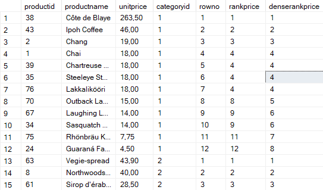
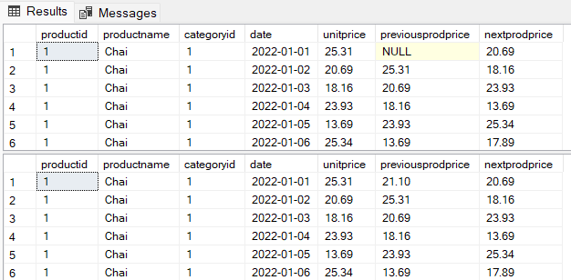
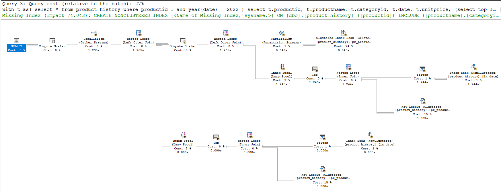
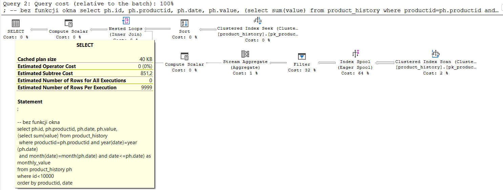

## SQL - Funkcje okna (Window functions) <br> Lab 2

---

**Imiona i nazwiska: Magdalena Wilk, Wiktoria Zalińska**

---

Celem ćwiczenia jest zapoznanie się z działaniem funkcji okna (window functions) w SQL, analiza wydajności zapytań i porównanie z rozwiązaniami przy wykorzystaniu "tradycyjnych" konstrukcji SQL

Swoje odpowiedzi wpisuj w miejsca oznaczone jako:

---

> Wyniki:

```sql
--  ...
```

---

### Ważne/wymagane są komentarze.

Zamieść kod rozwiązania oraz zrzuty ekranu pokazujące wyniki, (dołącz kod rozwiązania w formie tekstowej/źródłowej)

Zwróć uwagę na formatowanie kodu

---

## Oprogramowanie - co jest potrzebne?

Do wykonania ćwiczenia potrzebne jest następujące oprogramowanie:

- MS SQL Server - wersja 2019, 2022
- PostgreSQL - wersja 15/16/17
- SQLite
- Narzędzia do komunikacji z bazą danych
  - SSMS - Microsoft SQL Managment Studio
  - DtataGrip lub DBeaver
- Przykładowa baza Northwind/Northwind3
  - W wersji dla każdego z wymienionych serwerów

Oprogramowanie dostępne jest na przygotowanej maszynie wirtualnej

## Dokumentacja/Literatura

- Kathi Kellenberger,  Clayton Groom, Ed Pollack, Expert T-SQL Window Functions in SQL Server 2019, Apres 2019
- Itzik Ben-Gan, T-SQL Window Functions: For Data Analysis and Beyond, Microsoft 2020

- Kilka linków do materiałów które mogą być pomocne
   - [https://learn.microsoft.com/en-us/sql/t-sql/queries/select-over-clause-transact-sql?view=sql-server-ver16](https://learn.microsoft.com/en-us/sql/t-sql/queries/select-over-clause-transact-sql?view=sql-server-ver16)

  - [https://www.sqlservertutorial.net/sql-server-window-functions/](https://www.sqlservertutorial.net/sql-server-window-functions/)
  - [https://www.sqlshack.com/use-window-functions-sql-server/](https://www.sqlshack.com/use-window-functions-sql-server/)
  - [https://www.postgresql.org/docs/current/tutorial-window.html](https://www.postgresql.org/docs/current/tutorial-window.html)
  - [https://www.postgresqltutorial.com/postgresql-window-function/](https://www.postgresqltutorial.com/postgresql-window-function/)
  - [https://www.sqlite.org/windowfunctions.html](https://www.sqlite.org/windowfunctions.html)
  - [https://www.sqlitetutorial.net/sqlite-window-functions/](https://www.sqlitetutorial.net/sqlite-window-functions/)

- W razie potrzeby - opis Ikonek używanych w graficznej prezentacji planu zapytania w SSMS jest tutaj:
  - [https://docs.microsoft.com/en-us/sql/relational-databases/showplan-logical-and-physical-operators-reference](https://docs.microsoft.com/en-us/sql/relational-databases/showplan-logical-and-physical-operators-reference)

## Przygotowanie

Uruchom SSMS
- Skonfiguruj połączenie z bazą Northwind na lokalnym serwerze MS SQL

Uruchom DataGrip (lub Dbeaver)

- Skonfiguruj połączenia z bazą Northwind3
  - na lokalnym serwerze MS SQL
  - na lokalnym serwerze PostgreSQL
  - z lokalną bazą SQLite

Można też skorzystać z innych narzędzi klienckich (wg własnego uznania)

Oryginalna baza Northwind jest bardzo mała. Warto zaobserwować działanie na nieco większym zbiorze danych.

Baza Northwind3 zawiera dodatkową tabelę product_history

- 2,2 mln wierszy

Bazę Northwind3 można pobrać z moodle (zakładka - Backupy baz danych)

Można też wygenerować tabelę product_history przy pomocy skryptu

Skrypt dla SQL Srerver

Stwórz tabelę o następującej strukturze:

```sql
create table product_history(
   id int identity(1,1) not null,
   productid int,
   productname varchar(40) not null,
   supplierid int null,
   categoryid int null,
   quantityperunit varchar(20) null,
   unitprice decimal(10,2) null,
   quantity int,
   value decimal(10,2),
   date date,
 constraint pk_product_history primary key clustered
    (id asc )
)
```

Wygeneruj przykładowe dane:

Dla 30000 iteracji, tabela będzie zawierała nieco ponad 2mln wierszy (dostostu ograniczenie do możliwości swojego komputera)

Skrypt dla SQL Srerver

```sql
declare @i int
set @i = 1
while @i <= 30000
begin
    insert product_history
    select productid, ProductName, SupplierID, CategoryID,
         QuantityPerUnit,round(RAND()*unitprice + 10,2),
         cast(RAND() * productid + 10 as int), 0,
         dateadd(day, @i, '1940-01-01')
    from products
    set @i = @i + 1;
end;

update product_history
set value = unitprice * quantity
where 1=1;
```

Skrypt dla Postgresql

```sql
create table product_history(
   id int generated always as identity not null
       constraint pkproduct_history
            primary key,
   productid int,
   productname varchar(40) not null,
   supplierid int null,
   categoryid int null,
   quantityperunit varchar(20) null,
   unitprice decimal(10,2) null,
   quantity int,
   value decimal(10,2),
   date date
);
```

Wygeneruj przykładowe dane:

Skrypt dla Postgresql

```sql
do $$
begin
  for cnt in 1..30000 loop
    insert into product_history(productid, productname, supplierid,
           categoryid, quantityperunit,
           unitprice, quantity, value, date)
    select productid, productname, supplierid, categoryid,
           quantityperunit,
           round((random()*unitprice + 10)::numeric,2),
           cast(random() * productid + 10 as int), 0,
           cast('1940-01-01' as date) + cnt
    from products;
  end loop;
end; $$;

update product_history
set value = unitprice * quantity
where 1=1;
```

Wykonaj polecenia: `select count(*) from product_history`, potwierdzające wykonanie zadania

---

> Wyniki:

W bazie Postgres i SQL Server skrypt wygenerował 2310000 wierszy.

---

# Zadanie 1

Baza: Northwind, tabela product_history

Napisz polecenie, które zwraca: id pozycji, id produktu, nazwę produktu, id_kategorii, cenę produktu, średnią cenę produktów w kategorii do której należy dany produkt. Wyświetl tylko pozycje (produkty) których cena jest większa niż średnia cena.

W przypadku długiego czasu wykonania ogranicz zbiór wynikowy do kilkuset/kilku tysięcy wierszy

pomocna może być konstrukcja `with`

```sql
with t as (

....
)
select * from t
where id between ....
```

Napisz polecenie z wykorzystaniem podzapytania, join'a oraz funkcji okna. Porównaj zapytania. Porównaj czasy oraz plany wykonania zapytań.

Przetestuj działanie w różnych SZBD (MS SQL Server, PostgreSql, SQLite)

---

> Wyniki:

```sql
-- subquery
select id, productid, productname, categoryid, unitprice,
	(select avg(unitprice) from product_history ph
	where ph.categoryid=product_history.categoryid) as avg_price
from product_history
where unitprice > (select avg(unitprice) from product_history ph
	where ph.categoryid=product_history.categoryid);

-- join
 with avg_cat as (
 select categoryid, avg(unitprice) as avg_price
 from product_history
 group by categoryid
 )
 select ph.id, ph.productid, ph.productname, ph.categoryid, ph.unitprice, ac.avg_price
 from product_history ph join avg_cat ac
 on ph.categoryid=ac.categoryid
 where ph.unitprice > ac.avg_price;

 -- window function
select id, productid, productname, categoryid, unitprice, avg_price
from (
	select id, productid, productname, categoryid, unitprice,
		avg(unitprice) over(partition by categoryid) as avg_price
	from product_history
	) as subquery
where unitprice > avg_price;
```

Czas wykonywania zapytań w bazie SQL Server nie był długi, więc nie było potrzeby ograniczania się do wybranej liczby wierszy. W bazie Postgres i SQLite jest problem z wykonaniem pierwszego zapytania (z podzapytaniem), nawet kiedy ograniczamy liczbę wierszy. Czas oczekiwania jest bardzo długi. Pozostałe wykonują się bez problemów.


Najbardziej kosztownym zapytaniem jest zapytanie z funkcją okna. Zapytanie z podzapytaniem mimo, że ma mniejszy koszt wykonuje się zdecydowanie za długo w bazach Postgres i SQLite. Zdecydowanie najmniejszy koszt ma zapytanie z join'em i wykonuje sie też zdecydowanie najszybciej.

Poniżej porównanie kosztów i czasów wykonania zapytań dla SQL Server.
| | | |
| ------- | ---- | ----- |
|zapytanie | koszt| czas |
|subquery | 130 | 5851 |
|join | 75.6 | 3505 |
|window function | 290 | 15707 |

# Zadanie 2

Baza: Northwind, tabela product_history

Lekka modyfikacja poprzedniego zadania

Napisz polecenie, które zwraca: id pozycji, id produktu, datę, nazwę produktu, id_kategorii, cenę produktu oraz

- średnią cenę produktów w kategorii do której należy dany produkt.
- łączną wartość sprzedaży produktów danej kategorii (suma dla pola value)
- średnią cenę danego produktu w roku którego dotyczy dana pozycja
- łączną wartość sprzedaży produktu w roku którego dotyczy dana pozycja (suma dla pola value)

Napisz polecenie z wykorzystaniem podzapytania, join'a oraz funkcji okna. Porównaj zapytania. W przypadku funkcji okna spróbuj użyć klauzuli WINDOW.

Podobnie jak poprzednio, w przypadku długiego czasu wykonania ogranicz zbiór wynikowy do kilkuset/kilku tysięcy wierszy

Porównaj czasy oraz plany wykonania zapytań.

Przetestuj działanie w różnych SZBD (MS SQL Server, PostgreSql, SQLite)

---

> Wyniki:

```sql
-- window function
with t as (
	select id, productid, date, productname, categoryid, unitprice,
		avg(unitprice) over(partition by categoryid) as avg_price_for_cat,
		sum(value) over(partition by categoryid) as sum_val_for_cat,
		avg(unitprice) over(partition by YEAR(date)) as avg_for_year,
		sum(value) over(partition by YEAR(date)) as sum_for_year
	from product_history
	)
select * from t
where id between 1 and 200;

-- window function z użyciem window i datepart 
with t as (
	select id, productid, date, productname, categoryid, unitprice,
	avg(unitprice) over window_cat as avg_price_for_cat,
	sum(value) over window_cat as sum_val_for_cat,
	avg(unitprice) over window_year as avg_for_year,
	sum(value) over window_year as sum_for_year
	from product_history
	window
		window_cat as (partition by categoryid),
		window_year as (partition by date_part('year', date))
	)
select * from t
where id between 1 and 100;
```

Plan MS:


Plan Postgresql:


```sql
-- join
with avg_sum_per_cat as (
    select categoryid, avg(unitprice) as avg_price_for_cat, sum(value) as sum_val_for_cat
    from product_history
    group by categoryid
),
avg_sum_per_year as (
    select year(date) as year, avg(unitprice) as avg_for_year, sum(value) as sum_for_year
    from product_history
    group by year(date)
),
t as (
	select ph.id, ph.productid, ph.date, ph.productname, ph.categoryid, ph.unitprice, ac.avg_price_for_cat, ac.sum_val_for_cat, ay.avg_for_year, ay.sum_for_year
	from product_history ph
	join avg_sum_per_cat ac ON ph.categoryid = ac.categoryid
	join avg_sum_per_year ay ON year(ph.date) = ay.year
)
select * from t
where id between 1 and 200;
```

Plan MS:


Plan Postgresql:


```sql
--subquery
WITH ts AS (
    SELECT 
        ph.id,
        ph.productid,
        ph.date,
        ph.productname,
        ph.categoryid,
        ph.unitprice,
        (
            SELECT AVG(ph1.unitprice)
            FROM product_history ph1
            WHERE ph1.categoryid = ph.categoryid
        ) AS avg_price_for_cat,
        (
            SELECT SUM(ph2.value)
            FROM product_history ph2
            WHERE ph2.categoryid = ph.categoryid
        ) AS sum_val_for_cat,
        (
            SELECT AVG(ph3.unitprice)
            FROM product_history ph3
            WHERE YEAR(ph3.date) = YEAR(ph.date)
        ) AS avg_for_year,
        (
            SELECT SUM(ph4.value)
            FROM product_history ph4
            WHERE YEAR(ph4.date) = YEAR(ph.date)
        ) AS sum_for_year

    FROM product_history ph
)
SELECT *
FROM ts
WHERE id BETWEEN 1 AND 200;
```

Plan MS:


Plan Postgresql:


Poniżej porównanie czasów rzeczywistych przy ograniczeniu id od 1 do 200.
Dla MS SQL: elapsed time (set statistics time on/off).
Dla Postgresql: execution time (explain analyze).

| Operacja        | MS SQL[ms] | Postgres czas [ms] |
| --------------- | ---------- | ------------------ |
| Window function | 1419       | 8550.937           |
| Join            | 222        | 1100.068           |
| Subquery        | 201408     | 315267.447         |

Zapytanie z podzapytaniem zajmuje najwięcej czasu, zaś z joinem najmniej.

---

# Zadanie 3

Funkcje rankingu, `row_number()`, `rank()`, `dense_rank()`

Wykonaj polecenie, zaobserwuj wynik. Porównaj funkcje row_number(), rank(), dense_rank(). Skomentuj wyniki.

```sql
select productid, productname, unitprice, categoryid,
    row_number() over(partition by categoryid order by unitprice desc) as rowno,
    rank() over(partition by categoryid order by unitprice desc) as rankprice,
    dense_rank() over(partition by categoryid order by unitprice desc) as denserankprice
from products;
```

---

> Wyniki:
> Produkty zostały posortowane według kategorii i wyświetlone od największej do najmniejszej ceny (w każdej kategorii). Funkcja `row_number()` ponumerowała kolejno wiersze, zaczynając dla każdej kolejnej kategorii od 1. Funkcja `rank()` ponumerowała wiersze tworząc ranking, to znaczy wierszom o tej samej cenie w tej samej kategorii, przyporządkowała te same pozycje (numery) w rankingu, a następne wiersze są numerowane tak jakby nie było miejs remisowych, powstają luki w numeracji. Dla nowej kategorii również zaczyna numerowanie od początku. Funkcja `dense_rank()` działa podobnie jak `rank()`, z tym że kolejnym pozycją po wierszach remisowych, którym przypisała te same numery, kontynuuje numerując następnymi liczbami - nie tworzy luk w numeracji. Tak samo jak poprzednie funkcje, nowe kategorie zaczyna numerować od nowa.



---

Zadanie

Spróbuj uzyskać ten sam wynik bez użycia funkcji okna

---

> Wyniki:

```sql
select p1.productid, p1.productname, p1.unitprice, p1.categoryid,
	(select count(*) from products p2
	where p1.categoryid=p2.categoryid and
	(p1.unitprice < p2.unitprice or p1.unitprice=p2.unitprice
	and p1.productid > p2.productid)) + 1 as rowno,
	(select count(*) from products p2
	where p1.categoryid=p2.categoryid and
	p1.unitprice < p2.unitprice) + 1 as rankprice,
	(select count(distinct p2.unitprice) from products p2
	where p1.categoryid=p2.categoryid and
	p1.unitprice < p2.unitprice) + 1 as denserankprice
from products p1
order by p1.categoryid, p1.unitprice desc, p1.productid;
```

---

# Zadanie 4

Baza: Northwind, tabela product_history

Dla każdego produktu, podaj 4 najwyższe ceny tego produktu w danym roku. Zbiór wynikowy powinien zawierać:

- rok
- id produktu
- nazwę produktu
- cenę
- datę (datę uzyskania przez produkt takiej ceny)
- pozycję w rankingu

Uporządkuj wynik wg roku, nr produktu, pozycji w rankingu

---

> Wyniki:

```sql
with t as (
select year(date) as year, productid, productname, unitprice, date,
	rank() over(partition by year(date), productid order by unitprice desc) as rankprice
from product_history)
select * from t
where rankprice <= 4;
```

Zapytanie zwraca 4 najwyższe ceny licząc z remisami.

Spróbuj uzyskać ten sam wynik bez użycia funkcji okna, porównaj wyniki, czasy i plany zapytań. Przetestuj działanie w różnych SZBD (MS SQL Server, PostgreSql, SQLite)

---

> Wyniki:

```sql
with t as (
select year(p1.date) as year, p1.productid, p1.productname, p1.unitprice, p1.date,
	(select count(*) from product_history p2
	where p2.productid=p1.productid and year(p2.date)=year(p1.date)
	and p2.unitprice > p1.unitprice) as rankprice
from product_history p1)
select * from t
where rankprice <= 4
order by year, productid, unitprice desc;
```

Zapytanie z funkcją okna jest zdecydowanie szybsze i bardziej wydajne niż drugi sposób - wykonuje się w nieco ponad 2 sekundy w zależności od bazy. W przypadku drugiego zapytania - bez funkcji okna - jest problem, aby doczekać się jego wyniku w którejkolwiek z baz. Nawet po próbie ograniczenia liczby wierszy, `productid<1000`, czas wykonywania był zbyt długi - najdłuższa próba trwała ponad 8 minut.
Poniżej plan wykonania zapytania z funkcją okna w bazie SQL Server.


# Zadanie 5

Funkcje `lag()`, `lead()`

Wykonaj polecenia, zaobserwuj wynik. Jak działają funkcje `lag()`, `lead()`

```sql
select productid, productname, categoryid, date, unitprice,
       lag(unitprice) over (partition by productid order by date)
as previousprodprice,
       lead(unitprice) over (partition by productid order by date)
as nextprodprice
from product_history
where productid = 1 and year(date) = 2022
order by date;

with t as (select productid, productname, categoryid, date, unitprice,
                  lag(unitprice) over (partition by productid
order by date) as previousprodprice,
                  lead(unitprice) over (partition by productid
order by date) as nextprodprice
           from product_history
           )
select * from t
where productid = 1 and year(date) = 2022
order by date;
```

---

> Wyniki:

Funkcja 'lag()' -> zwraca poprzednią wartość według danej kolejności, zaś 'lead()' -> kolejną (tutaj: wartość ceny produktu poprzedniego/kolejnego zapisanego dnia).

W wyniku pierwszego zapytania te wartości są wybierane tylko dla productid = 1 i rok = 2022, zaś w drugim zapytaniu te funkcje wykonywane są dla wszystkich wierszy, a wyświetlane tylko dla productid = 1 i rok = 2022. Dlatego dla pierwszego zapytania pierwsza wartość zwracana przez 'lag' to null, a w wyniku drugiego zapytania zwracana jest wartość. Dla 'lead', w obu przypadkach dla ostatniej wartości jest null, ponieważ w bazie nie ma dat dalszych niż 2022.

## 

Zadanie

Spróbuj uzyskać ten sam wynik bez użycia funkcji okna, porównaj wyniki, czasy i plany zapytań. Przetestuj działanie w różnych SZBD (MS SQL Server, PostgreSql, SQLite)

---

> Wyniki:

```sql
WITH t AS (
    SELECT *
    FROM product_history
    WHERE productid = 1
      AND date_part('year', date) = 2022
)

SELECT 
    t.productid,
    t.productname,
    t.categoryid,
    t.date,
    t.unitprice,

    (
        SELECT unitprice
        FROM t t1
        WHERE t1.productid = t.productid
          AND t1.date < t.date
        ORDER BY t1.date DESC
        LIMIT 1
    ) AS previousprodprice,

    (
        SELECT unitprice
        FROM t t2
        WHERE t2.productid = t.productid
          AND t2.date > t.date
        ORDER BY t2.date
        LIMIT 1
    ) AS nextprodprice

FROM t;

WITH t AS (
    SELECT 
        ph.productid,
        ph.productname,
        ph.categoryid,
        ph.date,
        ph.unitprice,
        
        (
            SELECT unitprice
            FROM product_history ph1
            WHERE ph1.productid = ph.productid
              AND ph1.date < ph.date
            ORDER BY ph1.date DESC
            LIMIT 1
        ) AS previousprodprice,
        
        (
            SELECT unitprice
            FROM product_history ph2
            WHERE ph2.productid = ph.productid
              AND ph2.date > ph.date
            ORDER BY ph2.date
            LIMIT 1
        ) AS nextprodprice

    FROM product_history ph
)

SELECT *
FROM t
WHERE productid = 1
  AND date_part('year', date) = 2022
ORDER BY date;
-- dla MS SQL: zamiast limit 1, przy select top 1, zamiast date_part('year', date), year(date)

```

Plany obu zapytań z oknami:


Plan pierwszego zapytania bez korzystania z funkcji okna:



Plan drugiego zapytania bez korzystania z funkcji okna:


Poniżej porównanie czasów rzeczywistych.
Dla MS SQL: elapsed time (set statistics time on/off).
Dla Postgresql: execution time (explain analyze).

| Zapytanie              | Operacja   | MS SQL [ms] | Postgres [ms] |
| ---------------------- | ---------- | ----------- | ------------- |
| **Pierwsze zapytanie** | z window   | 230         | 210.091       |
|                        | bez window | 1276        | 152.932       |
| **Drugie zapytanie**   | z window   | 205         | 800.154       |
|                        | bez window | 47          | 20244.705     |

---

# Zadanie 6

Baza: Northwind, tabele customers, orders, order details

Napisz polecenie które wyświetla inf. o zamówieniach

Zbiór wynikowy powinien zawierać:

- nazwę klienta, nr zamówienia,
- datę zamówienia,
- wartość zamówienia (wraz z opłatą za przesyłkę),
- nr poprzedniego zamówienia danego klienta,
- datę poprzedniego zamówienia danego klienta,
- wartość poprzedniego zamówienia danego klienta.

---

> Wyniki:

```sql
with sum_of_order as(
    select od.orderid, o.orderdate, o.customerid, sum(unitprice * quantity * (1 - discount)) + o.freight as total_order
    from orderdetails od
    join orders o ON o.orderid = od.orderid
    group by od.orderid, o.orderdate, o.customerid, o.freight
),
orders_with_prev as(
    select orderid, customerid, orderdate,
           lag(orderid) over(partition by customerid order by orderdate) as prev_order_id,
           lag(orderdate) over(partition by customerid order by orderdate) as prev_order_date
    from orders o
)
select c.companyname, so.orderid, so.orderdate, so.total_order as order_value, op.prev_order_id,
       (select total_order from sum_of_order where orderid=op.prev_order_id) as prev_order_value,
       op.prev_order_date
from sum_of_order so
join orders_with_prev op ON so.orderid = op.orderid
join customers c ON so.customerid = c.customerid;
```

---

# Zadanie 7

Funkcje `first_value()`, `last_value()`

Baza: Northwind, tabele customers, orders, order details

Wykonaj polecenia, zaobserwuj wynik. Jak działają funkcje `first_value()`, `last_value()`. Skomentuj uzyskane wyniki. Czy funkcja `first_value` pokazuje w tym przypadku najdroższy produkt w danej kategorii, czy funkcja `last_value()` pokazuje najtańszy produkt? Co jest przyczyną takiego działania funkcji `last_value`. Co trzeba zmienić żeby funkcja last_value pokazywała najtańszy produkt w danej kategorii

```sql
select productid, productname, unitprice, categoryid,
    first_value(productname) over (partition by categoryid
order by unitprice desc) first,
    last_value(productname) over (partition by categoryid
order by unitprice desc) last
from products
order by categoryid, unitprice desc;
```

---

> Wyniki:

Funkcja 'first_value()' w tym przypadku pokazuje najdroższy produkt w danej kategorii, ponieważ w funkcji okna sortujemy według ceny od największej do najmniejszej.

Funkcja 'last_value()' nie pokazuje najtańszego produktu dla danej kategorii, ponieważ domyślnie sortownie jest dla:

```sql
range between unbounded preceding and current row
```

a więc brane są pod uwagę tylko produkty od największej ceny do obecnej.

Aby funkcja 'last_value()' pokazywała najtańszy produkt w danej kategorii, należy ustawić ograniczenie od początku do końca jak poniżej:

```sql
select productid, productname, unitprice, categoryid,
	first_value(productname) over (partition by categoryid order by unitprice desc) first,
	last_value(productname) over (partition by categoryid order by unitprice desc
	range between unbounded preceding and unbounded following) last
from products
order by categoryid, unitprice desc;
```

---

Zadanie

Spróbuj uzyskać ten sam wynik bez użycia funkcji okna, porównaj wyniki, czasy i plany zapytań. Przetestuj działanie w różnych SZBD (MS SQL Server, PostgreSql, SQLite)

---

> Wyniki:

```sql
select p.productid, p.productname, p.unitprice, p.categoryid,
	(select top 1 p1.productname from products p1 where p1.categoryid=p.categoryid order by unitprice desc) as first,
	(select top 1 p2.productname from products p2 where p2.categoryid=p.categoryid order by unitprice asc) as last
from products p
order by p.categoryid, p.unitprice desc;
```

Plan zapytania z funkcją okna:


Plan zapytania bez korzystania z funkcji okna:


Poniżej porównanie czasów rzeczywistych.
Dla MS SQL: elapsed time (set statistics time on/off).
Dla Postgresql: execution time (explain analyze).

| Operacja   | MS SQL[ms] | Postgres czas [ms] |
| ---------- | ---------- | ------------------ |
| z window   | 4          | 5.215              |
| bez window | 3          | 3.481              |

---

# Zadanie 8

Baza: Northwind, tabele orders, order details

Napisz polecenie które wyświetla inf. o zamówieniach

Zbiór wynikowy powinien zawierać:

- Id klienta,
- nr zamówienia,
- datę zamówienia,
- wartość zamówienia (wraz z opłatą za przesyłkę),
- dane zamówienia klienta o najniższej wartości w danym miesiącu
  - nr zamówienia o najniższej wartości w danym miesiącu
  - datę tego zamówienia
  - wartość tego zamówienia
- dane zamówienia klienta o najwyższej wartości w danym miesiącu
  - nr zamówienia o najniższej wartości w danym miesiącu
  - datę tego zamówienia
  - wartość tego zamówienia

---

> Wyniki:

```sql
with sum_of_order as(
    select od.orderid, o.orderdate, o.customerid, sum(unitprice * quantity * (1 - discount)) + o.freight as total_order
    from orderdetails od
    join orders o ON o.orderid = od.orderid
    group by od.orderid, o.orderdate, o.customerid, o.freight
)
	select customerid, orderid, orderdate, total_order,
	first_value(orderid) over window_year_month as min_orderid,
	first_value(orderdate) over window_year_month as min_orderdate,
	first_value(total_order) over window_year_month as min_order_value,
	last_value(orderid) over window_year_month as max_orderid,
	last_value(orderdate) over window_year_month as max_orderdate,
	last_value(total_order) over window_year_month as max_order_value
	from sum_of_order so
	window
		window_year_month as (partition by so.customerid, year(so.orderdate), month(so.orderdate) order by so.total_order range between unbounded preceding and unbounded following);
```

---

# Zadanie 9

Baza: Northwind, tabela product_history

Napisz polecenie które pokaże wartość sprzedaży każdego produktu narastająco od początku każdego miesiąca. Użyj funkcji okna

Zbiór wynikowy powinien zawierać:

- id pozycji
- id produktu
- datę
- wartość sprzedaży produktu w danym dniu
- wartość sprzedaży produktu narastające od początku miesiąca

W przypadku długiego czasu wykonania ogranicz zbiór wynikowy do kilkuset/kilku tysięcy wierszy

```sql
select id, productid, date, value,
	sum(value) over (partition by productid, year(date), month(date)
		order by date range between unbounded preceding and current row) as monthly_value
from product_history
where id<10000;
```

Spróbuj wykonać zadanie bez użycia funkcji okna. Spróbuj uzyskać ten sam wynik bez użycia funkcji okna, porównaj wyniki, czasy i plany zapytań. Przetestuj działanie w różnych SZBD (MS SQL Server, PostgreSql, SQLite)

---

> Wyniki:

```sql
select ph.id, ph.productid, ph.date, ph.value,
	(select sum(value) from product_history
	 where productid=ph.productid and year(date)=year(ph.date)
	 and month(date)=month(ph.date) and date<=ph.date) as monthly_value
from product_history ph
where id<10000
order by productid, date;
```

Plan zapytania z funkcją okna


Plan zapytania bez funkcji okna


Porównanie czasów zapytań:

| Operacja   | MS SQL[ms] | Postgres czas [ms] |
| ---------- | ---------- | ------------------ |
| z window   | 4000       | 836                |
| bez window | 11000      | -                  |

Dla zapytania bez funkcji okna w Postgres należałoby jeszcze bardziej ograniczyć liczbę wierszy - po 8 minutach zapytanie dalej się nie wykonało.

# Zadanie 10

Wykonaj kilka "własnych" przykładowych analiz. Czy są jeszcze jakieś ciekawe/przydatne funkcje okna (z których nie korzystałeś w ćwiczeniu)? Spróbuj ich użyć w zaprezentowanych przykładach.

---

> Wyniki:

```sql
-- Ranking procentowy (gdzie jest produkt w kategorii, od najtańszych do najdroższych)
select productid, productname, unitprice, categoryid,
    PERCENT_RANK() over (partition by categoryid order by unitprice) as percent_rank
from products
order by categoryid, unitprice;

-- Dystrybucja skumulowana (ile % produktów ma cenę mniejszą lub równą)
select productid, productname, unitprice, categoryid,
    CUME_DIST() over (partition by categoryid order by unitprice desc) as cume_dist
from products
order by categoryid, unitprice desc;
```

---

Punktacja

|         |     |
| ------- | --- |
| zadanie | pkt |
| 1       | 2   |
| 2       | 2   |
| 3       | 2   |
| 4       | 2   |
| 5       | 2   |
| 6       | 2   |
| 7       | 2   |
| 8       | 2   |
| 9       | 2   |
| 10      | 2   |
| razem   | 20  |
